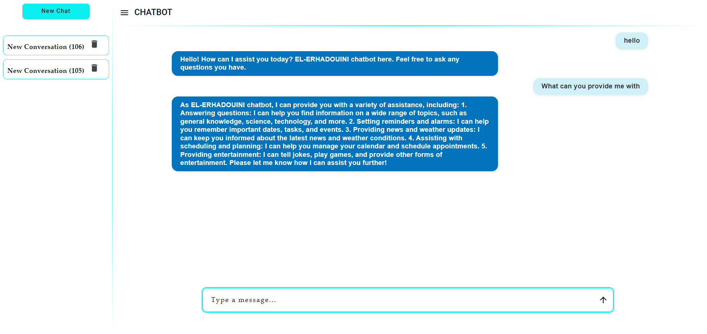

# Chatbot Project

## Overview

This project is a chatbot application consisting of a backend and a frontend. The backend is implemented in Python, while the frontend is built using Angular. The chatbot is designed to interact with users, providing responses based on the integrated different language models including those from ollama and GROQ.

## Prerequisites

Before you begin, ensure you have met the following requirements:

- **Python 3.8+**: Make sure you have Python installed. You can download it from [python.org](https://www.python.org/downloads/).
- **Node.js and npm**: Ensure you have Node.js and npm installed. You can download them from [nodejs.org](https://nodejs.org/).
- **SQLite**: Ensure you have SQLite installed. You can download it from [sqlite.org](https://www.sqlite.org/download.html).

## Backend

The backend is a Python application that handles the core logic of the chatbot. It uses various language models to generate responses.

### Key Files

- `main.py`: Entry point for the backend application.
- `llms/LLMEnum.py`: Enumeration of different language models.
- `llms/LLMFactory.py`: Factory class to create instances of language models.

### Setup

1. **Create a virtual environment:**
    ```sh
    python -m venv venv
    ```

2. **Activate the virtual environment:**
    - On Windows:
        ```sh
        venv\Scripts\activate
        ```
    - On macOS/Linux:
        ```sh
        source venv/bin/activate
        ```

3. **Install dependencies:**
    ```sh
    pip install -r chatbot-backend/requirements.txt
    ```

4. **Run the backend:**
    ```sh
    python chatbot-backend/main.py
    ```

## Frontend

The frontend is an Angular application that provides the user interface for interacting with the chatbot.

### Key Files

- `src/app/app.component.ts`: Main component of the Angular application.
- `server.ts`: Server-side rendering entry point.

### Setup

1. **Install dependencies:**
    ```sh
    npm install
    ```

2. **Run the frontend:**
    ```sh
    npm start
    ```

3. **Build the frontend:**
    ```sh
    npm run build
    ```

4. **Run tests:**
    ```sh
    npm test
    ```

## Environment Variables

The project uses environment variables to manage configuration. Create a `.env` file in the [chatbot-backend](chatbot-backend) directorie with the necessary variables.

## interface

here is how the chatbot interface looks like:



## License

This project is licensed under the MIT License. See the [LICENSE](LICENSE) file for details.

## Contact

For any questions or feedback, contact me on the following email: [a.akanoun@edu.umi.ac.ma](mailto:a.akanoun@edu.umi.ac.ma)
